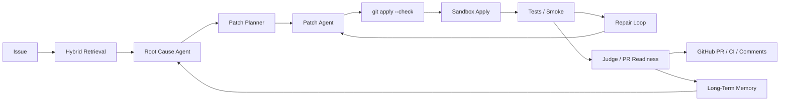

# RepoPilot

RepoPilot is a production-shaped multi-agent coding agent for real repositories.

It takes an issue, retrieves the relevant code, reasons about the root cause, proposes and validates patches, applies them in an isolated sandbox, runs tests, collects GitHub CI feedback, and stores durable repair memory for future runs.

This project is intentionally not a toy chatbot. The useful unit is a repository workflow:

1. index code with lexical, structural, and embedding retrieval
2. localize files, symbols, and likely call paths
3. use a real OpenAI-compatible LLM as the reasoning engine
4. generate structured root-cause analysis and patch plans
5. validate unified diffs with `git apply --check`
6. apply candidate patches in a sandbox copy
7. run `pytest` / smoke checks
8. loop on repair feedback when validation fails
9. create or update GitHub PRs
10. poll CI checks and write PR comments
11. save long-term repair memory in SQLite

## Current Capabilities

- Multi-agent workflow with a LangGraph-compatible state graph
- Real LLM integration through DashScope/Qwen or any OpenAI-compatible endpoint
- Hybrid retrieval: keyword, AST/symbol signals, call hints, embeddings, and rerank scoring
- Sandbox patch apply and test execution
- Worktree patch apply with guardrails
- GitHub PR, CI, and PR comment integration
- CI feedback collection for repair context
- Long-term repository memory in `.repopilot/memory.sqlite3`
- Benchmark runner with stable multi-case evaluation
- FastAPI dashboard for interactive runs

## Quick Start

### 1. Install

```powershell
python -m venv .venv
.\.venv\Scripts\python.exe -m pip install -e .[dev]
```

### 2. Configure

Copy `.env.example` to `.env`.

For DashScope/Qwen:

```env
DASHSCOPE_API_KEY=your-key
QWEN_MODEL=qwen-plus
QWEN_BASE_URL=https://dashscope.aliyuncs.com/compatible-mode/v1
```

Optional embedding configuration:

```env
EMBEDDING_BASE_URL=https://dashscope.aliyuncs.com/compatible-mode/v1
EMBEDDING_API_KEY=your-key
EMBEDDING_MODEL=text-embedding-v4
```

Generic OpenAI-compatible providers are also supported:

```env
LLM_BASE_URL=https://api.example.com/v1
LLM_API_KEY=your-key
LLM_MODEL=gpt-4o-mini
```

For GitHub integration:

```env
GITHUB_TOKEN=github_pat_or_classic_token
```

The token needs repository access for PR creation, reading checks, and writing comments.

### 3. Run The Agent

Use the graph workflow for the production path:

```powershell
.\.venv\Scripts\python.exe run_repo_pilot.py --repo . --issue "API returns an unstable JSON schema; locate the endpoint and model definitions." --run-tests --apply-sandbox --save-run --use-llm --require-llm --graph
```

To allow a validated patch to be applied back to the working tree:

```powershell
.\.venv\Scripts\python.exe run_repo_pilot.py --repo . --issue "Fix a failing package import when the API server starts." --run-tests --apply-sandbox --apply-worktree --save-run --use-llm --require-llm --graph
```

To create a PR, poll CI, and comment back to GitHub:

```powershell
.\.venv\Scripts\python.exe run_repo_pilot.py --repo . --issue "GitHub integration smoke" --run-tests --apply-sandbox --apply-worktree --create-pr --poll-ci --comment-body "RepoPilot validation passed." --save-run --use-llm --require-llm --graph
```

## Long-Term Memory

RepoPilot saves compact repair memories in:

```text
.repopilot/memory.sqlite3
```

Each memory stores the issue, root-cause summary, suspected files, patch evidence, evaluation result, GitHub/CI feedback, and an embedding for semantic recall.

Memory is enabled by default:

```powershell
.\.venv\Scripts\python.exe run_repo_pilot.py --repo . --issue "..." --use-llm --graph
```

Disable recall or saving when needed:

```powershell
.\.venv\Scripts\python.exe run_repo_pilot.py --repo . --issue "..." --no-memory
.\.venv\Scripts\python.exe run_repo_pilot.py --repo . --issue "..." --no-save-memory
```

## API / Dashboard

Start the local dashboard:

```powershell
.\.venv\Scripts\python.exe -m uvicorn app.api.server:app --reload --port 8000
```

Open:

```text
http://127.0.0.1:8000
```

The dashboard exposes run options for LLM, sandbox apply, tests, GitHub PR/CI, and memory.

## Benchmark

```powershell
.\.venv\Scripts\python.exe run_benchmark.py --use-llm --require-llm --run-tests --apply-sandbox --save-run
```

Baseline comparison:

```powershell
.\.venv\Scripts\python.exe run_benchmark.py --use-llm --require-llm --run-tests --apply-sandbox --compare-baseline
```

## Architecture



See:

- `docs/architecture.md`
- `docs/benchmark.md`
- `docs/github_integration.md`
- `docs/memory.md`

## What Makes It Different From Direct LLM Calls

A direct LLM call answers from prompt context only. RepoPilot adds tool-grounded execution:

- repository indexing and retrieval before generation
- structured multi-agent roles instead of one free-form prompt
- patch validation with Git tooling
- isolated sandbox apply
- real test execution
- CI feedback recovery
- durable memory across runs
- PR-ready evidence and comments

That means the agent can be evaluated by code facts, not only by fluent explanations.
