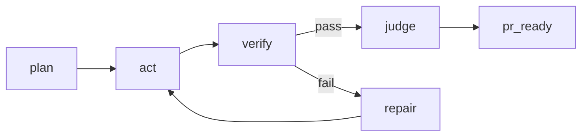

# RepoPilot

真实可运行的 **LLM 多智能体软件研发智能体 / Coding Agent**。  
输入一个 issue，RepoPilot 会读取真实代码仓库，检索相关代码，生成根因假设、修改计划、patch 建议，执行 patch 校验、测试、sandbox apply，并给出 PR 准备信息。

当前项目已经接入：

- 真实 Qwen / DashScope `qwen-plus`
- 多智能体工作流
- StateGraph 架构
- `git apply --check`
- sandbox apply
- `pytest` / smoke check
- SQLite 运行记录
- benchmark

## What It Does

RepoPilot 不是简单问答机器人，而是一个围绕代码仓库工作的 Agent 系统：

1. 读取仓库并建立轻量代码索引
2. 检索 issue 相关文件、符号和调用
3. 使用真实 LLM 生成根因分析和修改计划
4. 生成 unified diff 风格 patch 建议
5. 执行 `git apply --check`
6. 在隔离副本中真正 `git apply`
7. 运行 `pytest` 和 smoke check
8. 保存运行记录到 SQLite
9. 生成 PR readiness 信息

## Quick Start

### 1. Environment

推荐 Python `>=3.11`。

安装：

```powershell
python -m venv .venv
.\.venv\Scripts\python.exe -m pip install -e .[dev]
```

### 2. Configure Model

复制 `.env.example` 为 `.env`。

当前项目兼容你的 DashScope / Qwen 配置：

```env
DASHSCOPE_API_KEY=your-key
QWEN_MODEL=qwen-plus
QWEN_BASE_URL=https://dashscope.aliyuncs.com/compatible-mode/v1
```

可选 embedding 配置：
```env
EMBEDDING_BASE_URL=https://dashscope.aliyuncs.com/compatible-mode/v1
EMBEDDING_API_KEY=your-key
EMBEDDING_MODEL=text-embedding-v4
```

也兼容通用 OpenAI-compatible 变量：

```env
LLM_BASE_URL=https://api.example.com/v1
LLM_API_KEY=your-key
LLM_MODEL=gpt-4o-mini
```

### 3. Run RepoPilot

推荐直接运行状态图版本：

```powershell
.\.venv\Scripts\python.exe run_repo_pilot.py --repo . --issue "API 返回 JSON schema 字段不稳定，需要定位接口和模型定义" --run-tests --apply-sandbox --save-run --use-llm --require-llm --graph
```

如果你希望在 sandbox 验证通过后，把 patch 真正落到原仓库：

```powershell
.\.venv\Scripts\python.exe run_repo_pilot.py --repo . --issue "运行 API 服务时出现 No module named app，怀疑是启动目录或包路径配置问题。" --run-tests --apply-sandbox --apply-worktree --save-run --use-llm --require-llm --graph
```

如果 `gh auth status` 正常，或者已经配置 `GITHUB_TOKEN` 且仓库存在 `origin` 指向 GitHub，可直接创建 PR、拉取 CI 和回写评论：

```powershell
.\.venv\Scripts\python.exe run_repo_pilot.py --repo . --issue "..." --run-tests --apply-sandbox --apply-worktree --create-pr --poll-ci --pr-number 123 --comment-body "RepoPilot validation passed." --save-run --use-llm --require-llm --graph
```

或者直接使用脚本：

```powershell
.\scripts_run_repo_pilot.ps1
```

### 4. API Service

```powershell
.\scripts_start_api.ps1
```

接口：

- `GET /health`
- `POST /repo-pilot/diagnose`
- `GET /repo-pilot/ui`

Dashboard：

```text
http://127.0.0.1:8000/repo-pilot/ui
```

## Example Output

运行后会得到：

- 根因假设
- 疑似文件
- 修改计划
- patch 建议
- patch 校验结果
- 测试执行结果
- sandbox apply 结果
- worktree apply 结果
- 二次修复建议
- PR readiness
- 规则评分 + LLM Judge

## Architecture

### Multi-Agent

- `RepoIndexer` Tool Agent
- `CodeRetriever` Tool Agent
- `HybridEmbeddingRetriever` Tool Agent
- `RootCauseAgent` (LLM)
- `PatchPlannerAgent` (LLM)
- `PatchSuggestionAgent` (LLM)
- `TestRunner` Tool Agent
- `RepairAdvisorAgent` (LLM)
- `RepoJudgeAgent` (LLM + Rubric)

### StateGraph



设计范式：

```text
Plan -> Act -> Verify -> Repair -> Judge -> PR Ready
```

当前优先使用 **官方 LangGraph**；只有在 LangGraph 不可用时，才回退到本地轻量 StateGraph runtime。

## Benchmark

运行 benchmark：

```powershell
.\.venv\Scripts\python.exe run_benchmark.py --use-llm --require-llm --run-tests --apply-sandbox --save-run
```

对比 rule-based baseline 和 LLM 模式：

```powershell
.\.venv\Scripts\python.exe run_benchmark.py --use-llm --require-llm --run-tests --apply-sandbox --compare-baseline
```

当前 benchmark 案例文件：

```text
benchmarks/repo_pilot_cases.json
```

当前结果示例：

```json
{
  "case_count": 8,
  "pass_rate": 0.75,
  "average_overall": 0.86
}
```

这个 benchmark 是“真跑”的，不是静态填表：失败 case 会真实保留下来。当前 runner 会逐 case 打印进度和耗时，长跑时也能看到活性。

## Persistence

运行记录会保存到：

```text
.repopilot/runs.sqlite3
```

patch 文件会保存到：

```text
.repopilot/patches/
```

sandbox 副本位置：

```text
.repopilot/sandbox/
```

## Dashboard

当前项目已经内置一个轻量 dashboard：

- repo 路径输入
- issue 输入
- graph / llm / sandbox / worktree / save-run 开关
- summary 面板
- graph trace 面板
- full JSON 面板

它不花哨，但足够用于演示、调试和 GitHub 截图。

## Open Source Case

项目已经在真实开源仓库 `python-slugify` 上做过验证，并完成过低风险优化案例。相关说明见：

- [repo_pilot_open_source_case.md](C:/Users/HP/Documents/Codex/2026-06-08/files-mentioned-by-the-user-2/outputs/repo_pilot_open_source_case.md)

## Project Layout

```text
app/
  api/
  core/
  eval/
  scenarios/
benchmarks/
docs/
run_repo_pilot.py
run_benchmark.py
```

## Limitations

当前版本仍有这些限制：

- patch 仍以建议和 sandbox apply 为主，没有直接改动原仓库
- worktree apply 默认关闭，只有显式启用后才会尝试改动原仓库
- worktree apply 只允许改动 allowlist 内文件，并会在落地前创建备份、在 git 仓库中阻止脏工作区直接写入
- auto re-apply 已经会基于 sandbox 失败日志生成下一轮 patch，但仍然没有做语义级 merge / conflict resolution
- 检索还没有接 embedding / vector DB / rerank
- dashboard 仍然比较轻量
- `gh` 未登录时不会自动创建 PR

## Why This Is Better Than a Simple LLM Call

直接调用大模型只能生成建议；RepoPilot 会：

- 读取真实仓库
- 检索真实代码（hybrid lexical + embedding + rerank）
- 执行真实测试
- 检查 patch 是否可应用
- 在 sandbox 中验证
- 能接 GitHub PR / CI / comment
- 保存结果
- 做 benchmark

它更接近真正的 Coding Agent，而不是 Chatbot。

## Roadmap

1. 加 embedding + vector retrieval + rerank
2. 做 patch conflict resolution 和语义级 merge
3. 增强 dashboard 历史 run 对比能力
4. GitHub PR 自动创建与评论回写
5. 接入更强 benchmark 数据集
