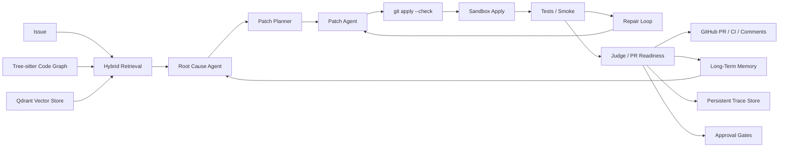

# RepoPilot

RepoPilot is a production-shaped multi-agent coding agent for real repositories.

It takes an issue, retrieves the relevant code, reasons about the root cause, proposes and validates patches, applies them in an isolated sandbox, runs tests, collects GitHub CI feedback, and stores durable repair memory for future runs.

This project is intentionally not a toy chatbot. The useful unit is a repository workflow:

1. index code with lexical, structural, and embedding retrieval
2. localize files, symbols, and likely call paths
3. use a real OpenAI-compatible LLM as the reasoning engine
4. generate structured root-cause analysis and patch plans
5. validate unified diffs with `git apply --check`
6. apply candidate patches in a sandbox copy
7. run `pytest` / smoke checks
8. loop on repair feedback when validation fails
9. create or update GitHub PRs
10. poll CI checks and write PR comments
11. save long-term repair memory in SQLite

## Why This Project Matters

RepoPilot is designed to look and behave like a serious software engineering agent instead of a prompt wrapper.

The current implementation includes:

- Tree-sitter code knowledge graph
- Qdrant dense + sparse hybrid retrieval with RRF fusion
- GraphRAG-style retrieval with graph propagation rerank
- LangGraph-style execution with persistent traces
- approval gates before worktree or GitHub mutation
- structured repair signals from `pytest`, `git apply`, and GitHub CI
- SWE-bench style evaluation runner

## Current Capabilities

- Multi-agent workflow with a LangGraph-compatible state graph
- Real LLM integration through DashScope/Qwen or any OpenAI-compatible endpoint
- Tree-sitter code knowledge graph for Python, JavaScript, TypeScript, and TSX
- Qdrant-backed hybrid retrieval: lexical, dense vector, symbol/call/import, and rerank scoring
- Qdrant dense + sparse hybrid retrieval with RRF fusion
- Impacted-file prediction from code graph subgraphs
- Sandbox patch apply and test execution
- Worktree patch apply with guardrails
- GitHub PR, CI, and PR comment integration
- CI feedback collection for repair context
- Long-term repository memory in `.repopilot/memory.sqlite3`
- Persistent graph traces in `.repopilot/traces.sqlite3`
- Approval gates in `.repopilot/approvals.sqlite3`
- SWE-bench style runner in `run_swe_bench_style.py`
- Benchmark runner with stable multi-case evaluation
- FastAPI dashboard for interactive runs
- Execution-unit-driven multi-candidate patch generation
- Coordinated patch portfolio selection with closed-loop preference

## Validated Results

Recent local validation on this project:

- `pytest`: passed
- Tree-sitter code graph: parsed 36 repository files
- code graph extraction: 233 symbols, 1502 relations
- hybrid retrieval backend: `qdrant_local_dense_sparse_rrf`
- approval gate smoke: passed
- SWE-style runner smoke: `pass_at_1 = 1.0`
- GitHub CI on PR branch: passed

## Public Benchmark Snapshot

Latest stable self-hosted SWE-style snapshot:

- `case_count = 8`
- `pass_rate = 1.0`
- `average_overall = 0.936`
- `average_elapsed_seconds = 70.3`
- coverage includes retrieval, approval gates, repair signals, memory, trace store, GitHub workflow discovery, and dashboard operator paths

Latest representative real-repo case:

- repository: `python-slugify`
- task: contributor-facing README improvement and test-entry guidance
- overall score: `0.907`
- `patch_apply_check = 1.0`
- localized files: `README.md`, `test.py`

See:

- `docs/benchmark.md`
- `docs/case_studies.md`

## Recent Validated Upgrades

Recent work focused on making documentation-oriented patching behave more like a real coding agent instead of a generic LLM wrapper.

- improved open-source README patch quality on `python-slugify`
- improved self-repo README patch quality for Quick Start, benchmark output explanation, and SQLite run-history guidance
- added whitespace-tolerant `git apply` fallback for mixed-EOL repositories
- added automatic unified-diff hunk recounting so valid patches are less likely to fail on line-count drift
- kept benchmark scoring tied to real patch checks, sandbox apply, and executable test signals

The result is a stronger patch-quality profile:

- self-repo documentation and operator-facing cases now reach `0.954`
- open-source documentation cases now reach `0.907`
- full 8-case benchmark average is `0.936`

## Quick Start

### 1. Install

```powershell
python -m venv .venv
.\.venv\Scripts\python.exe -m pip install -e .[dev]
```

### 2. Configure

Copy `.env.example` to `.env`.

For DashScope/Qwen:

```env
DASHSCOPE_API_KEY=your-key
QWEN_MODEL=qwen-plus
QWEN_BASE_URL=https://dashscope.aliyuncs.com/compatible-mode/v1
```

Optional embedding configuration:

```env
EMBEDDING_BASE_URL=https://dashscope.aliyuncs.com/compatible-mode/v1
EMBEDDING_API_KEY=your-key
EMBEDDING_MODEL=text-embedding-v4
```

Generic OpenAI-compatible providers are also supported:

```env
LLM_BASE_URL=https://api.example.com/v1
LLM_API_KEY=your-key
LLM_MODEL=gpt-4o-mini
```

For GitHub integration:

```env
GITHUB_TOKEN=github_pat_or_classic_token
```

The token needs repository access for PR creation, reading checks, and writing comments.

### 3. Run The Agent

Use the graph workflow for the production path:

```powershell
.\.venv\Scripts\python.exe run_repo_pilot.py --repo . --issue "API returns an unstable JSON schema; locate the endpoint and model definitions." --run-tests --apply-sandbox --save-run --use-llm --require-llm --graph
```

To allow a validated patch to be applied back to the working tree:

```powershell
.\.venv\Scripts\python.exe run_repo_pilot.py --repo . --issue "Fix a failing package import when the API server starts." --run-tests --apply-sandbox --apply-worktree --save-run --use-llm --require-llm --graph
```

To create a PR, poll CI, and comment back to GitHub:

```powershell
.\.venv\Scripts\python.exe run_repo_pilot.py --repo . --issue "GitHub integration smoke" --run-tests --apply-sandbox --apply-worktree --create-pr --poll-ci --comment-body "RepoPilot validation passed." --save-run --use-llm --require-llm --graph
```

To inspect or approve mutation gates created by graph runs:

```powershell
.\.venv\Scripts\python.exe run_approval.py --repo . --list
.\.venv\Scripts\python.exe run_approval.py --repo . --approve "<gate_id>" --reason "approved after diff review"
```

## Long-Term Memory

RepoPilot saves compact repair memories in:

```text
.repopilot/memory.sqlite3
```

Each memory stores the issue, root-cause summary, suspected files, patch evidence, evaluation result, GitHub/CI feedback, and an embedding for semantic recall.

Memory is enabled by default:

```powershell
.\.venv\Scripts\python.exe run_repo_pilot.py --repo . --issue "..." --use-llm --graph
```

Disable recall or saving when needed:

```powershell
.\.venv\Scripts\python.exe run_repo_pilot.py --repo . --issue "..." --no-memory
.\.venv\Scripts\python.exe run_repo_pilot.py --repo . --issue "..." --no-save-memory
```

## API / Dashboard

Start the local dashboard:

```powershell
.\.venv\Scripts\python.exe -m uvicorn app.api.server:app --reload --port 8000
```

Open:

```text
http://127.0.0.1:8000
```

The dashboard exposes run options for LLM, sandbox apply, tests, GitHub PR/CI, and memory.

## Benchmark

```powershell
.\.venv\Scripts\python.exe run_benchmark.py --use-llm --require-llm --run-tests --apply-sandbox --save-run
```

Baseline comparison:

```powershell
.\.venv\Scripts\python.exe run_benchmark.py --use-llm --require-llm --run-tests --apply-sandbox --compare-baseline
```

Single-candidate vs multi-candidate patch generation comparison:

```powershell
.\.venv\Scripts\python.exe run_benchmark.py --run-tests --apply-sandbox --compare-multi-candidate
```

No-graph vs graph-enhanced retrieval comparison:

```powershell
.\.venv\Scripts\python.exe run_benchmark.py --run-tests --apply-sandbox --compare-graph-ablation
```

SWE-bench style evaluation:

```powershell
.\.venv\Scripts\python.exe run_swe_bench_style.py --cases benchmarks\swe_style_cases.json --work-dir .repopilot\swe_runs --max-cases 8
```

The runner reports:

- `pass_at_1`
- per-case elapsed time
- external test status
- `saved_run_id`
- `graph_run_id`
- `trace_db_path`
- `markdown_table`

Current local SWE-style suite contains 8 self-hosted cases for:

- retrieval and graph localization
- approval gate behavior
- repair signal parsing
- SWE-style runner behavior
- GitHub workflow discovery
- memory store discovery
- persistent trace and checkpoint discovery
- dashboard and operator controls

To inspect persisted checkpoints for a graph run:

```powershell
.\.venv\Scripts\python.exe run_approval.py --repo . --checkpoints "<graph_run_id>"
```

For a concise public-facing summary of the strongest recent runs, see `docs/case_studies.md`.

## Architecture



See:

- `docs/architecture.md`
- `docs/benchmark.md`
- `docs/case_studies.md`
- `docs/github_integration.md`
- `docs/memory.md`

## What Makes It Different From Direct LLM Calls

A direct LLM call answers from prompt context only. RepoPilot adds tool-grounded execution:

- repository indexing and retrieval before generation
- structured multi-agent roles instead of one free-form prompt
- code graph and hybrid retrieval instead of plain chunk similarity
- patch validation with Git tooling
- isolated sandbox apply
- real test execution
- CI feedback recovery
- durable memory across runs
- approval gates before destructive actions
- persistent traces and checkpoints
- PR-ready evidence and comments

That means the agent can be evaluated by code facts, not only by fluent explanations.
